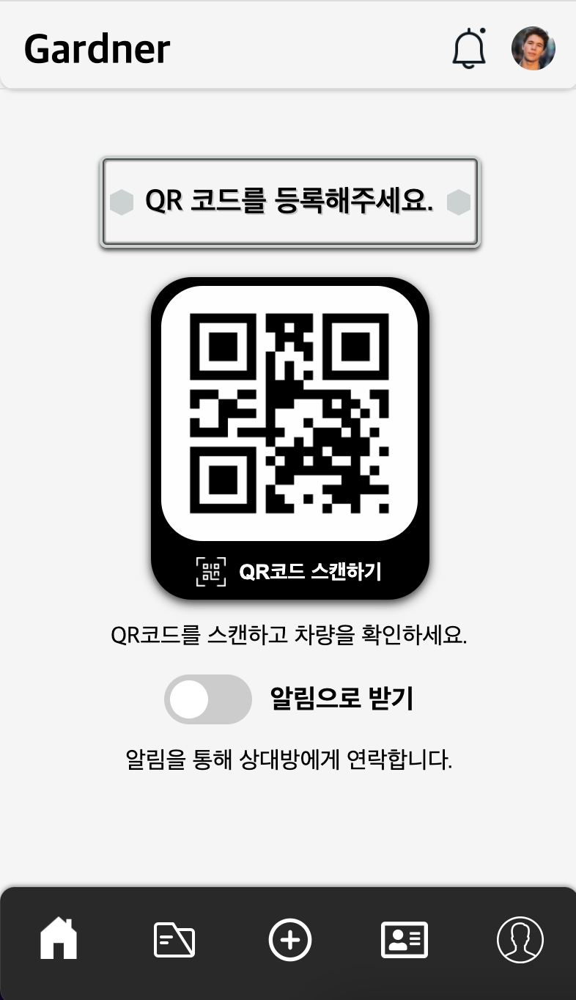
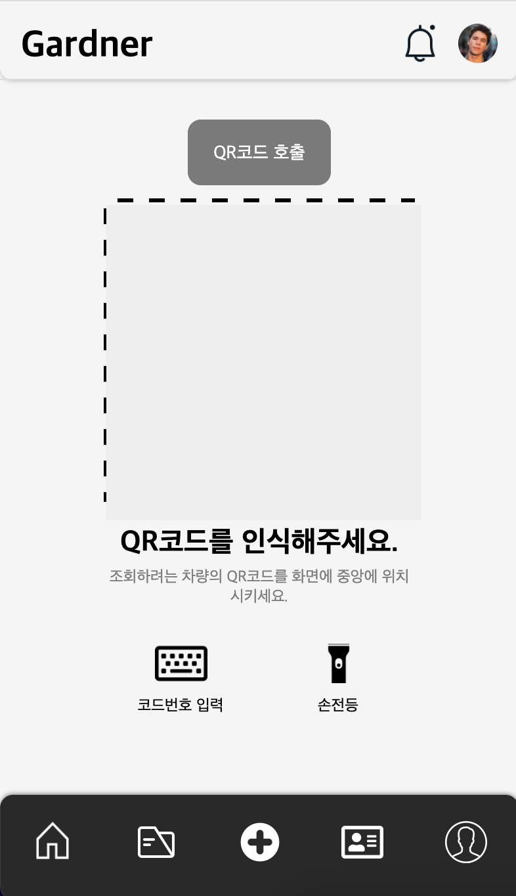
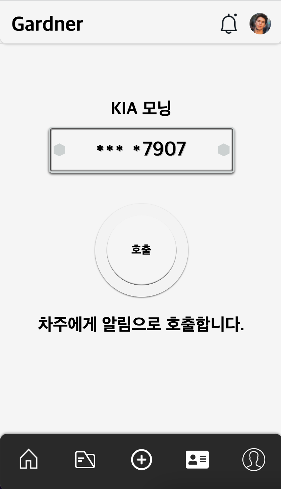

# Gardner :blue_car:

가드너는 차량마다 QR코드를 가지고 있다는 가상의 설정을 통해 제작한 프로젝트다. 완전한 서비스를 구현하지 않고, 프론트엔드 기술에서만 개발하는 것을 목표로 했다.

<!-- 프로젝트에 대한 간단한 설명 -->

### Description

<!-- 프로젝트 화면 보여주기 -->

- 목적: **QR 코드를 통해 차량을 인식**하고, 이 정보를 통해 호출자와 차량의 소유주가 서로 **개인정보를 유출하지 않고 서로 연락**을 취할 수 있는 시뮬레이션 환경 개발.
- URL: https://brad-go.github.io/Gardner/index.html
- 제작 기간: 2021.12.4 - 2021.12.10

### Built with

- HTML5
- CSS3
- **JAVASCRIPT**
- VisualStudioCode
- Git

### Getting Started

이 프로젝트는 브라우저에서 동작하지만, 모바일 환경에서 사용할 것을 생각하고 만들었기 때문에, 모바일 웹을 통해 보거나 개발자모드를 통해서 보는 것을 추천합니다.

<!-- 작성한 코드를 실행하기 전 설치해야 할 파일 이나 패키지 등 -->

#### Prerequisite

- Browser: Javascript 1.7이상을 지원하는 크롬 브라우저에서 실행을 권장
- OS: Mac OS Monterey 12.0.1의 환경에서 개발을 진행했습니다.
- **Camera**: 이 사이트를 사용하기 위해선 웹캠이나 모바일의 카메라가 필요합니다.

#### Installation

브라우저에서 동작하는 것을 기반으로 만들었기 때문에 추가적인 설치는 필요하지 않습니다.

1. Clone this repo
   ```
    git clone https://github.com/brad-go/Gardner.git
   ```

<!-- 작성한 코드를 어떻게 실행해야 하는지에 대한 가이드 라인 -->

### Usage

<div align="center" justify="space-between">
  
  
  
</div>

1. URL을 통해서 브라우저에 접속한 후에 카메라 접근 권한을 허용해주세요.
2. 가운데 스캔 버튼을 클릭하면 자동으로 qr페이지로 넘어갑니다.
3. 카메라에 qr코드를 인식시켜주세요.
4. 2초의 로딩 후에 호출 페이지로 넘어갑니다.

<!-- 작업 목록 체크리스트 -->

### Roadmap

#### Screen

- [x] 모바일 환경에 맞춰서 제작하기
  - 브라우저마다 차이가 있다. 완전한 반응형으로 만들 수 있을까?
- [x] 내비게이션 바 제작하기
- [ ] 로그인 화면 만들기
- [x] 메인 페이지 만들기
  - [x] 차량 번호판 모형 만들기
- [ ] 수신 기록 페이지 만들기
- [x] QR코드 인식 페이지 만들기
- [x] 차주에 대한 정보와 호출 버튼을 가진 페이지

#### Function

##### Main Page

- [x] 스캔 버튼을 클릭하면 페이지 이동
- [x] 다른이의 호출을알림으로 받을 지, 전화로 받을지 결정할 수 있는 버튼 만들기
  - [x] 버튼의 값이 변경되면 안내문 변경하기

##### Records Page

- [ ] 상대방이 호출 시(임의) 수신 기록이 생기게 하기
- [ ] 수신 기록 검색
- [ ] 수신 기록 페이지만 스크롤 가능하게 하기
- [ ] 수신 기록 클릭 시 호출자와의 대화 창 열리게 하기
  - 대화한 것 확인할 수 있게

##### QR Page

- [x] QR 코드를 인식하는 카메라 구현하기
  - [x] QR 코드 인식 시, 인식됨을 알리기
    - [x] 인식 시 문구 변경, 실패 시 문구 변경
  - [x] QR 코드 인식 시, 호출 페이지로 이동하기
- [x] QR 인식을 실패했을 때를 대비한 코드 입력 버튼
  - [ ] 코드 입력 페이지 만들기
  - [ ] 코드 입력 페이지에 들어가면 상단에서 코드가 온 것을 알림으로 전송
  - [ ] 올바른 코드 입력 시 호출 페이지로 이동하기
- [x] 야간 사용을 위한 flash 버튼
  - [ ] 휴대폰의 flash를 켜는 기능

##### Summon Page

- [x] 호출 버튼 만들기
  - [x] 호출 로딩 시간 임의 구현
  - [x] 호출 로딩 시 모션 CSS로 표현
- [x] 호출 시 문구 변경
- [x] 호출 완료 시 재호출 버튼 만들기

##### User Page

- [ ] 프로필 사진을 변경할 수 있는 기능
- [ ] 이름 변경할 수 있는 기능
- [ ] 이메일, sns계정 등 입력
- [ ] 차량 정보를 올릴 수 있는 기능

##### Footer Navigation Bar

- [x] 버튼 클릭 시 해당 페이지로 이동하기
- [x] 버튼 클릭 시 클릭된 이미지로 변경하기
- [x] 페이지 이동을 감지해서 클릭된 이미지로 바뀔 수 있게하기

<!-- 추가로 공부해보고 싶은 것 -->

### Additional Thigs To Study

- [ ] jsQR.js의코드 뜯어보기
- [ ] qr.js의 코드 완벽히 이해하기
- [ ] qr코드 인식이 아닌 일반 카메라 구현해보기
- [ ] native app으로 만들 수 있는 방법 찾아보기

<!-- 프로젝트를 진행하면서 만난 문제들과 해결책 -->

### Problems & Solution

#### 1. 버튼이 사라지는 문제

##### Problem

- 하단 내비게이션의 다섯가지 버튼은 img태그를 두개씩 사용해서 클릭시 서로 바뀔 수 있도록 구현했다. 클릭 이벤트를 이용해서 구현했는데, **img가 바뀌고 난 뒤에 그림이 버튼 태그 자체가 사라져 버리는 현상이 발생**했다.
- **이벤트의 타겟**을 이용해서 버튼의 이미지를 클릭하고 그것을 변수에 저장하고 **nextElementSibling**을 통해 뒤의 이미지를 다른 변수에 저장하고 그것들을 바꾸는 방식의 코드였다.

##### Solution

- **문제 인식**: 이미지가 사라지는 것은 당연했다. 이미지가 바뀌고 나면 바뀐 이미지에게는 **nextElementSibling가 없기 때문에** 이미지가 사라져 버린다.
- **문제 해결**: *e.target*을 사용하지 않고 버튼 태그를 통해서 html에 작성된 img태그에 접근했다. 그리고 그들을 변경하는 방식으로 해결했다.

  ```js
  const handleBtnImages = (button) => {
    const currentImg = button.childNodes[1].childNodes[1];
    const nextImg = button.childNodes[1].childNodes[3];

    currentImg.classList.toggle(HIDDEN);
    nextImg.classList.toggle(HIDDEN);
  };
  ```

#### 2. 페이지 변경 시에 아래 버튼의 이미지가 변경하기

##### Problem

- 하단 내비게이션을 이용해서 페이지를 이동하면 버튼의 이미지가 바뀌면서 페이지가 이동한다. 스캔 버튼을 이용해서 페이지가 바뀔 때도 하단의 이미지가 바뀌게 만들었다.
- 그러나 아무런 클릭 이벤트 없이 페이지가 이동하는 QR인식 후에 페이지가 이동하면 아래 버튼의 이미지가 바뀌지 않았다.

##### Solution

- **문제 인식**: 페이지 이동하는 것을 감지할 수 있는 코드가 필요했다. addEventListener의 여러 이벤트를 살펴봤지만 이 방식으로는 할 수 없는 것 같았다.
- **문제 해결**: 자바스크립의 observer를 이용해서 해결할 수 있었다. observer로 qr페이지의 classList를 감시하게 했다. 그냥 감시하게 하고 동작을 보니 다른 버튼이 클릭되고 페이지가 이동할 때도 모두 변경사항이라고 여기는 것 같았다. 그래서 내부 함수에 조건을 통해서 문제를 해결했다.
  새로운 문제가 발생했는데, 해당 동작이 진행되면 observer의 감시가 종료되어야 페이지 이동이 계속 일어나기 때문에 observer의 종료가 필요했다. 그래서 내부 함수에 종료를 구현해 놓았다. 그러나 이 때문에 observer는 새로고침 전까지는 한 번 밖에 동작할 수 없었다.
  그래서 페이지 이동이 일어나는 것은 아래의 navigation을 통해서 일어나기 때문에 이 페이지가 아니라면 다시 observer를 동작하는 방식으로 해결했다.

  ```js
  const buttons = document.querySelectorAll('.catergories-wrap button')

  for(let button of buttons) {
    button.addEventListener('click', (e) => {
      const handleObserver = (button) => {
        if (button.className !== 'btn-summon') {
          observer.observe(summonPage, config);
        }
      }
    }
  }
  ```

<!-- 내 프로젝트에 기여하고 싶다면 -->

### Contributing

만약 당신이 이 프로젝트를 더 좋게 만들 제안사항이 있다면 이 저장소를 fork하고 pull request를 보내주세요. 또는 "enhancement" 태그를 통해서 간단한 이슈를 열 수도 있습니다. 프로젝트에 별점을 주는 것도 잊지마세요! 감사합니다.

1. 프로젝트 Fork 하기
2. 당신만의 브랜치를 만들어주세요.
   ```
   git checkout -b feature/AmazingFeature
   ```
3. 원하는 작업을 한 뒤 변경사항을 커밋해주세요.
   ```
   git commit -m "Add some AmazingFeature"
   ```
4. 브랜치에 Push하기
   ```
   git push origin feature/AmazingFeature
   ```
5. Pull request 보내기

<!-- 참조 -->

### Reference

- 큐알코드를 인식하는 웹캠을 구현하지는 못했기 때문에, 아래 링크의 **jsQR.js**파일을 인용해서 사용했다. https://github.com/cozmo/jsQR

### Contact

:email: Email: dhjk35@naver.com

<a href="https://instagram.com/brad_go95">

</a>
<a href="https://github.com/brad-go">

</a>

<!-- Markdown Links & Images -->
